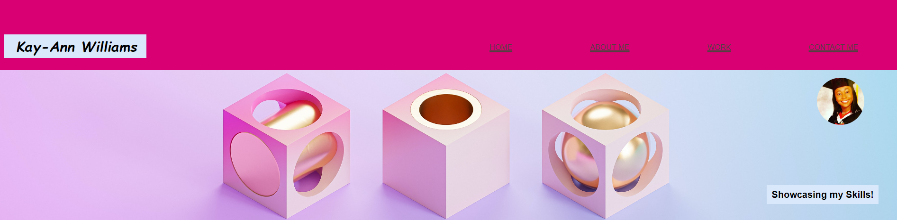
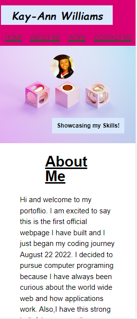

# First Homepage - Portfolio
Homepage created using css style sheet and html index file

## Description
I created this profolio homepage so that I am be able to showcase the skills I have learned so far.
These skills include CSS and HTML. 

## What is included in my porfolio homepage?
My portfolio homepage includes a header with my name and a navigation bar with links to my sections.

****

There is an about me section which includes details about myself. There is a work section with images that in the future will be screenshots of my future projects. Currently, the images link to a code refactor assignment that I completed. 

****

I've also included a hover feature on my profile image as well as on my main work image. 

Finally, there is a contact section with contact information. 

## What did I learn?
I have learned how to effectively used media queries. 

****

## Please access website using the link below:
https://kay-annn.github.io/first-homepage/

## Licence
I used the MIT licence, please refer to licence in repository. 

